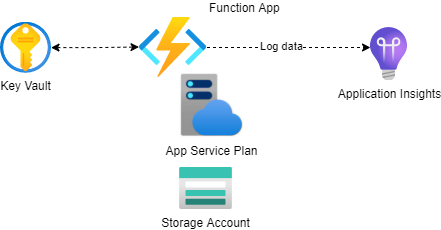

# Deploy an Azure Function using Bicep
This project illustrates how an Azure Function can be deployed as IaC via Bicep.


## Description

The project provides the following Bicep templates:

- Function App (without settings)
- App Service Plan
- Storage Account
- Application Insights
- Key Vault
- Function App Settings

The individual resources can be found under the [bicep/templates](bicep/templates/) folder, these are all linked and deployed from the [main.bicep](bicep/main.bicep) file.

For more detailed information, please checkout my [blog post](https://dev.to/manukanne/azure-infrastructure-as-code-deploy-an-azure-function-using-bicep-1i04) :smiley:



## Getting Started
### Perquisites 
- Azure Account with an active subscription. In case you do not have an Azure Account, go ahead and create one for free [here](https://azure.microsoft.com/en-us/free/)
- [Azure CLI](https://docs.microsoft.com/en-us/cli/azure/install-azure-cli)
- [Bicep Tools](https://docs.microsoft.com/en-us/azure/azure-resource-manager/bicep/install) for Azure CLI and VS Code 

### How to deploy the templates
#### Create a parameter file    
The example [parameter file](example-deployment-parameters.json) looks like this:
```json
{
    "$schema": "https://schema.management.azure.com/schemas/2019-04-01/deploymentParameters.json#",
    "contentVersion": "1.0.0.0",
    "parameters": {
      "storageAccountName": {
        "value": "stvm<storage-account-name>"
      },
      "storageAccountSku": {
        "value": "Standard_LRS"
      },
      "applicationInsightsName": {
          "value": "appi-<application-insights-name>"
      },
      "planName": {
          "value": "plan-<plan-name>"
      },
      "planOS": {
          "value": "Linux|Windows"
      },
      "functionAppName": {
          "value": "func-<plan-name>"
      },
      "functionAppRuntime": {
          "value": "dotnet|python|node|java"
      },
      "keyVaultName": {
          "value": "kv-<key-vault-name>"
      },
      "keyVaultSku": {
          "value": "standard"
      },
      "databaseConnectionString": {
          "value": ""
      }
    }
  }
```

#### Create a resource group
```bash
az group create -n <name> - <location>
```

> :information_source: If you want to deploy to an existing resource group, you can skip this step.


#### Deployment

```bash
az deployment group create \
  --name <deployment-name> \
  --resource-group <resource-group-name> \
  --template-file bicep\main.bicep
  --parameters @<path-to-parameters>
```

> :information_source: Before using the deployment command, please call _az login_ and specify the subscription you want to use.

## Authors

Contributors names and contact info:
- [Manuel Kanetscheider](https://dev.to/manukanne) 

## License

This project is licensed under the MIT License - see the [LICENSE](LICENSE) file for details.